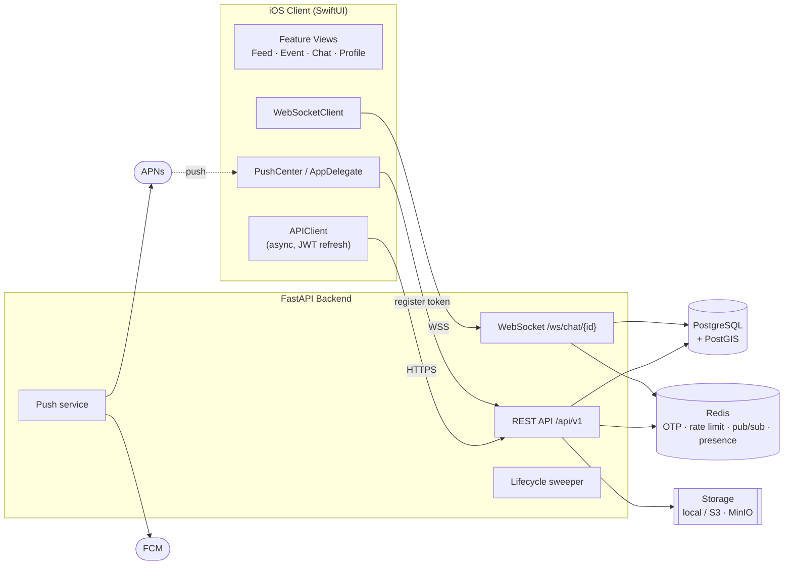

<p align="center">
  
</p>

# Activity

**Create a "let's do X, looking for company" post in under a minute — and find 2–5 people nearby who want in.**

Activity (internal codename *Skhodka* — Russian for "meetup") is a location-based, activity-agnostic meetup app. Anyone can post *what they want to do, when, and where* — jet skis, tennis, a concert, a walk, board games, a museum trip — and people nearby see it in a geo feed and request to join. Once the organizer accepts, a group chat spins up automatically, and after the event both sides leave short two-way reviews to build trust.

The repository contains a native **SwiftUI iOS client** and an **async FastAPI backend** backed by **PostgreSQL + PostGIS**, with real-time chat over WebSockets and push notifications via **APNs** (iOS) and **FCM** (Android-ready).


---

## Overview

Finding company for a specific activity on a specific day is still awkward: niche vertical apps only cover one hobby, social-network posts sink in the feed, and personal circles run out. Activity is one shared local stream where any idea — from a spontaneous evening walk to renting jet skis for the weekend — becomes a joinable event.

The core loop is deliberately tight:

1. **Create** an event (what / when / where / how many people / description).
2. **Publish** it to a proximity feed for users nearby (PostGIS radius search).
3. **Request** to join; the organizer accepts, rejects, or lets auto-accept and a waitlist handle it.
4. **Coordinate** in an auto-created group chat with real-time presence, typing, and read receipts.
5. **Review** each other after the event to feed a two-way reputation system.

## Features

**Auth & identity**
- Phone-number registration verified by SMS OTP (Redis-backed, rate-limited, resend cooldown).
- Password login with brute-force throttling; SMS-verified password reset that revokes all sessions.
- JWT access tokens with rotating, hashed, revocable refresh tokens.
- Profile gating: creating events / joining requires a completed profile (name, avatar, bio).

**Events & geo feed**
- Full event CRUD with cover image, up to 5 photos, price and split model, min/max (or unlimited) participants.
- PostGIS proximity feed with radius search, distance sorting, and cursor pagination — computed without N+1 via correlated subqueries.
- Quick time filters (`today` / `tomorrow` / `weekend`), category filter, and escaped text search over title/description.
- Location from a pasted Yandex.Maps link (parsed server-side) or raw coordinates.
- Manual finish plus a background sweeper that auto-finishes past events and archives their chats.

**Participation & matching**
- Join → pending / auto-accepted / waitlisted based on capacity and organizer settings.
- Organizer accept/reject; freed seats promote the next person off the waitlist.
- Blocklist applied both ways in the feed and on join.

**Real-time chat**
- WebSocket group chat per event (and standalone groups), with history, typing indicators, presence, and read receipts.
- Multi-instance fan-out via Redis pub/sub; presence tracked in Redis sets so it works across horizontally scaled workers.
- Archived conversations become read-only.

**Trust & safety**
- Two-way post-event reviews (organizer ↔ participants) that recompute a rolling rating average.
- User reports and blocking.

**Push notifications**
- APNs (iOS, direct `.p8` token auth) and FCM HTTP v1 (Android) behind one `send_push` interface.
- Device-token registration endpoint; invalid tokens are auto-pruned on delivery failure.
- Graceful degradation: if a provider isn't configured, delivery logs a stub instead of failing the request.

**Media & storage**
- Pluggable storage backend: local volume or S3 / MinIO.
- Images validated and re-encoded via Pillow (resize by longest side, EXIF stripped).

**Production hardening**
- Redis-based per-IP rate limiting, structured JSON logs with request IDs, deep health check (DB + Redis), env-driven CORS, and fail-fast config validation that refuses to boot with insecure production settings.
- Alembic migrations, a production Docker Compose (gunicorn + uvicorn workers), and CI that rebuilds the schema from scratch before running the suite.

## Architecture



- **iOS** talks to the backend over a small async `APIClient` (bearer auth with transparent one-shot token refresh) and a `WebSocketClient` for chat. `PushCenter` + `AppDelegate` register the APNs device token and post it to `/devices`.
- **FastAPI** exposes versioned REST routers plus a WebSocket endpoint. Business logic lives in `app/services`; routers stay thin. A lifespan-managed background task sweeps stale events.
- **PostgreSQL + PostGIS** stores everything; the geo feed uses `ST_DWithin` / `ST_Distance` with a GiST index on the event point.
- **Redis** backs OTP storage, login/IP rate limiting, chat pub/sub fan-out, and cross-instance presence.

## Tech Stack

| Layer | Technology |
|---|---|
| iOS client | Swift 5, SwiftUI (iOS 17+), MVVM, `URLSession` async/await, `URLSessionWebSocketTask`, CoreLocation, UserNotifications |
| iOS tooling | XcodeGen (`project.yml`) |
| Backend | Python 3.11+, FastAPI, Uvicorn / Gunicorn |
| Data | PostgreSQL + PostGIS, SQLAlchemy 2.0 (async), GeoAlchemy2, Shapely, asyncpg |
| Cache / realtime | Redis (OTP, rate limiting, WebSocket pub/sub, presence) |
| Auth | JWT (python-jose), bcrypt, rotating refresh tokens |
| Media | Pillow, boto3 (S3 / MinIO) |
| Push | aioapns (APNs), google-auth + FCM HTTP v1 |
| Migrations | Alembic |
| Infra | Docker, Docker Compose, GitHub Actions CI |
| Quality | pytest, ruff, mypy |

## Project Structure

```
activity/
├── CONCEPT.md                     # Product concept (RU)
├── backend/                       # FastAPI service
│   ├── app/
│   │   ├── main.py                # App factory, lifespan, middleware
│   │   ├── api/v1/                # Routers: auth, users, events, participations,
│   │   │                          #          conversations, reviews, reports, chat (WS)
│   │   ├── core/                  # config, security, deps, middleware, exceptions, logging
│   │   ├── db/                    # Async engine, session, declarative base
│   │   ├── models/                # SQLAlchemy models (user, event, participation, …)
│   │   ├── schemas/               # Pydantic request/response schemas
│   │   ├── services/              # event, matching, chat, otp, geo, push, storage, lifecycle
│   │   └── ws/                    # WebSocket connection manager (Redis pub/sub)
│   ├── migrations/                # Alembic
│   ├── tests/                     # pytest suite
│   ├── docker-compose.yml         # dev (api + postgis + redis)
│   ├── docker-compose.prod.yml    # prod (gunicorn workers + migrate)
│   └── requirements.txt
└── frontend/
    └── Skhodka/                   # SwiftUI iOS app (XcodeGen project)
        └── Skhodka/
            ├── Config/            # AppConfig (backend host)
            ├── Core/              # Networking, Auth, Push, Location, Extensions
            ├── Models/            # Codable DTOs
            ├── Features/          # Auth, Feed, EventCreate, EventDetail, Chats,
            │                      # Participants, Profile, Reviews, Onboarding, Root
            └── DesignSystem/      # Theme, shared views
```

## Getting Started

### Backend

Requires Docker (recommended) or Python 3.11+ with a local PostgreSQL/PostGIS + Redis.

```bash
cd backend
cp .env.example .env          # dev-safe defaults
docker compose up --build
```

- API: `http://localhost:8000` · Swagger UI: `http://localhost:8000/docs`
- Deep health check (DB + Redis): `http://localhost:8000/api/v1/health`
- In dev, tables are auto-created (`AUTO_CREATE_TABLES=true`); in production use Alembic.
- OTP codes aren't sent by SMS in dev — they're printed to the `api` logs:
  ```bash
  docker compose logs -f api | grep OTP
  ```

Running without Docker:

```bash
cd backend
python -m venv .venv && source .venv/bin/activate
pip install -r requirements.txt
cp .env.example .env
# point DATABASE_URL / REDIS_URL at your local services, then:
uvicorn app.main:app --reload
```

### iOS

Requires Xcode 15+ (iOS 17 SDK) and [XcodeGen](https://github.com/yonaskolb/XcodeGen).

```bash
cd frontend/Skhodka
xcodegen generate            # builds Skhodka.xcodeproj from project.yml
open Skhodka.xcodeproj
```

- The Simulator reaches the backend at `localhost:8080` by default.
- To run on a physical device on the same Wi-Fi, set your Mac's LAN IP in `Config/AppConfig.swift` (a `./setip.sh` helper automates this).
- Push notifications require a paid Apple Developer team and an APNs `.p8` key configured on the backend (`APNS_*` env vars).

## API Overview

Base path: `/api/v1`. Full interactive contract at `/docs`.

| Method | Path | Purpose |
|---|---|---|
| `POST` | `/auth/request-code` | Send SMS OTP (registration / reset) |
| `POST` | `/auth/register` | Verify OTP, set password, issue tokens |
| `POST` | `/auth/login` | Phone + password login |
| `POST` | `/auth/refresh` | Rotate refresh → new token pair |
| `POST` | `/auth/reset-password` | OTP-verified password reset (revokes sessions) |
| `GET`  | `/users/me` · `PATCH /users/me` | Read / update own profile |
| `POST` | `/users/me/avatar` · `/users/me/photos` | Upload profile media |
| `POST` | `/events` · `GET /events` | Create event · geo feed (lat/lng/radius, filters, cursor) |
| `GET/PATCH/DELETE` | `/events/{id}` | Read / edit / cancel event |
| `POST` | `/events/{id}/finish` | Finish event → enable reviews, archive chat |
| `POST` | `/events/{id}/join` · `DELETE .../join` | Request to join · leave |
| `GET`  | `/events/{id}/participants` | List participants (organizer sees all statuses) |
| `POST` | `/participations/{id}/accept` · `/reject` | Organizer decision |
| `GET`  | `/conversations` · `/conversations/{id}/messages` | Chat list · message history |
| `WS`   | `/ws/chat/{conversation_id}?token=` | Real-time chat (message / typing / read / presence) |
| `POST` | `/events/{id}/reviews` · `GET /users/{id}/reviews` | Leave / list reviews |
| `POST` | `/reports` · `/users/{id}/block` | Report / block a user |
| `POST` | `/devices` · `DELETE /devices/{token}` | Register / remove push device token |

## Status / Roadmap

**Implemented** — phone-OTP auth with refresh rotation, profile gating, event CRUD, PostGIS geo feed, join/accept/reject with auto-accept and waitlist promotion, blocking, WebSocket chat with multi-instance Redis fan-out and read receipts, event lifecycle sweeper, two-way reviews and ratings, reports, S3/MinIO media with Pillow processing, rate limiting, structured logging, deep health, Alembic migrations, production Compose, and CI.

**Push** — APNs and FCM HTTP v1 delivery paths are wired; production sends require real provider credentials (APNs `.p8`, FCM service account).

**Next** — real SMS provider integration (SMSC/Twilio interface exists), category subscriptions with push, partner-slot booking, load testing, and APM/monitoring on target infrastructure.

## License

MIT © 2026 Egor Fomenko — see [LICENSE](LICENSE).
